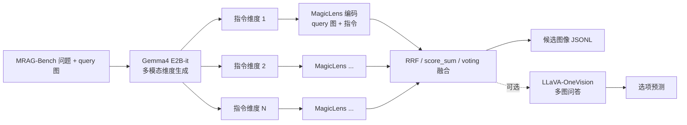

# Gemma 4 E2B 多模态维度规划 + MagicLens 多维 RAG 流水线

本文说明如何用**本地 Gemma 4 E2B-it**（多模态）根据**查询图 + 问题**生成多条 **MagicLens 指令式检索 query**，再融合候选图像；需要端到端 A/B/C/D 评测时可选接 LLaVA 作答。环境变量与可复制命令见文末。

## 架构（数据流）




- **Gemma 4（google/gemma-4-E2B-it）**：在 Hugging Face 文档中定位为 **E2B**（Edge-to-Bridge）规模的 **多模态指令模型**；本仓库用 `AutoProcessor` + `AutoModelForImageTextToText`（或新版 `AutoModelForMultimodalLM`）加载。输入为 **系统提示（要求输出 N 条英文检索指令）+ 用户消息（本地图片路径 + 问题文本）**；输出经 `parse_dimension_lines` 解析为 N 条短句，每条作为 MagicLens 的 **text 分支** 与同一 query 图组合检索。
- **MagicLens**：对每个维度，用 query 图像 + 该条英文指令编码，与语料库向量比对（实现见 `src/mrag/magiclens.py`、`src/mrag/multi_dim_pipeline.py`）。
- **融合**：多路 Top-K 列表合并（`src/mrag/fusion.py`）。
- **LLaVA（可选）**：将 query 图与融合后的检索图一并送入多模态问答（`--final-answerer llava`）。

核心代码：


| 模块                               | 作用                                          |
| -------------------------------- | ------------------------------------------- |
| `src/mrag/gemma4_loader.py`      | 加载 Processor / 多模态模型（与 `test/gemma4.py` 共用） |
| `src/mrag/gemma4_dims.py`        | 构建图文 chat + `generate` + 解析 N 条指令           |
| `src/mrag/query_planner.py`      | 维度规划系统提示与 `parse_dimension_lines`           |
| `test/pipeline_multi_dim_rag.py` | CLI：`--dim-generator-type gemma4_local`     |


## 密钥与配置

将 `example.env` 复制为仓库根目录 `.env`，填写 `HF_TOKEN`（下载/门禁）、按需填写 `DIM_GENERATOR_API_KEY`（若仍用 API 模式）。**不要把真实密钥写入仓库或提交到 git。**

## 有网（infinity）与无网（GPU）分工

计算节点 **无外网**、登录机 **infinity 等有网** 时，把「下载 / 建缓存」和「跑实验」拆开，避免进程里任何 Hugging Face / 数据集拉取。

### 在 **infinity（有网）** 完成

1. **Gemma4 权重**：`python test/gemma4.py --mode download`（或 `huggingface-cli download` 到 `models/gemma4-e2b`）。
2. **LLaVA 权重（仅端到端答题需要）**：按 `README.md` / 组内约定把 `llava-onevision-qwen2-7b-ov` 等目录准备完整。
3. **MagicLens 权重**：`models/magic_lens_clip_base.pkl`（或 large）已就位。
4. **MRAG-Bench 与 HF 缓存**：沿用 E0-E7 的官方 `github/MRAG-Bench/eval/utils/dataloader.py::bench_data_loader` 入口；在本机执行一次 `load_dataset("uclanlp/MRAG-Bench", split="test")` 或跑通一小段 pipeline，使 `HF_HOME`、`HF_DATASETS_CACHE`（或 `~/.cache/huggingface`）里已有快照。
5. **语料**：`CORPUS_DIR` 指向的 `image_corpus` 整棵目录。

将上述 **仓库目录 + 缓存目录**（按需）打包或 `rsync` 到 GPU 节点同一相对路径，保证 GPU 上 **不需要再解析 `huggingface.co`**。

### 在 **GPU（无网）** 运行

1. 在 **仓库根** `.env`（或启动前 `export`）建议打开离线开关（见 `example.env` 注释）：

   - 脚本默认设置 `HF_HUB_OFFLINE=1`、`TRANSFORMERS_OFFLINE=1`、`HF_DATASETS_OFFLINE=1`：禁止静默联网；缺文件会立刻报错，便于发现未同步的缓存。如确需联网刷新缓存，显式设置 `MRAG_ALLOW_HF_NETWORK=1`。
   - 将 `HF_HOME` / `HF_DATASETS_CACHE` 指到已从 infinity 拷过来的目录。

2. **`pipeline_multi_dim_rag.py` 会在 `import jax` 之前加载 `.env`**，并且默认 `--magiclens-platform cpu`：若出现日志里 **CuDNN 运行时版本低于 jaxlib 编译版本**（例如 runtime 9.1 vs compile 9.8）导致 `DNN library initialization failed`，先用 CPU 跑通 MagicLens（会慢）；长期方案是在 GPU 节点升级 CuDNN / 换与系统匹配的 `jaxlib` wheel。确认 JAX GPU 环境可用后，可显式传 `--magiclens-platform cuda`。

3. 启动命令仍在仓库根执行，且 **`gemma4_local` + `--final-answerer none` 只读本地 Gemma4/MagicLens/MRAG 数据**，不会加载 LLaVA，也不应对 Hub 发起 Llama 请求；若仍看到对某个模型的 `HEAD https://huggingface.co/...`，说明某依赖在 import 阶段触发了 Hub，需在 infinity 上预生成同名缓存或升级/精简 import 链。

## 环境与依赖

- PyTorch **≥ 2.4**（与当前 transformers 对 Gemma4 processor 的要求一致）。
- `pip install -U 'transformers>=4.51' accelerate huggingface_hub pillow`
- 权重目录：`GEMMA4_LOCAL_DIR`（默认 `models/gemma4-e2b`），可先执行下载模式（见下）。

## 可复制命令

在仓库根目录（`mRAG/`），且已配置 `.env` 中的 `HF_TOKEN` 等：

```bash
# 1) 下载 Gemma4 E2B 到本地（仅需一次；已下载可跳过）
python test/gemma4.py --mode download

# 2) 单机冒烟：文本 + 图文（验证权重与 CUDA）
python test/gemma4.py --mode run
# 指定图与设备示例：
# python test/gemma4.py --mode run --device cuda:1 --image "$(python scripts/inspect_data_layout.py --print-one-corpus-image)"

# 3) 可审计 smoke test（5 条）：Gemma4 分解 5 维 → MagicLens 5x5 → 融合 5 图 → Gemma4 描述 → LLaVA 作答评分
# 无网 GPU 示例（.env 中已配置 HF_*_OFFLINE 时）：
# set -a && source .env && set +a && export CORPUS_DIR=...
export CORPUS_DIR=data/image_corpus  # 语料根目录
mkdir -p log/E8
python test/pipeline_multi_dim_rag.py \
  --dataset-name uclanlp/MRAG-Bench \
  --corpus-dir "${CORPUS_DIR}" \
  --dim-generator-type gemma4_local \
  --gemma4-local-dir models/gemma4-e2b \
  --gemma4-model-id google/gemma-4-E2B-it \
  --gemma4-device cuda:0 \
  --gemma4-dim-rationale \
  --n-dims 5 \
  --dim-top-k 5 \
  --final-top-k 5 \
  --fusion-strategy rrf \
  --final-answerer llava \
  --describe-final-images \
  --magiclens-platform cpu \
  --max-samples 5 \
  --llava-device-map balanced \
  --llava-max-images 1 \
  --llava-max-new-tokens 64 \
  --answers-file log/E8/gemma4_multi_dim_smoke.jsonl \
  --summary-out log/E8/gemma4_multi_dim_smoke_summary.json \
  --save-dimensions-jsonl log/E8/gemma4_multi_dim_smoke_dims.jsonl \
  --trace-jsonl log/E8/gemma4_multi_dim_smoke_trace.jsonl > E8.log 2>&1
```

冒烟通过的标志：

- 日志出现 `accuracy=... processed=5 dim_gen_failures=0`。
- `log/E8/gemma4_multi_dim_smoke_dims.jsonl` 中每行包含 `question_with_choices` 与 `instructions`。
- `log/E8/gemma4_multi_dim_smoke.jsonl` 中包含 `meta_fused_retrieval` 与 `meta_per_dim_retrieval`。
- `log/E8/gemma4_multi_dim_smoke_trace.jsonl` 每行是一条完整可审计记录，包含：
  - `input`：query 图、本题 question、A/B/C/D 选项；
  - `dimension_generation`：Gemma4 输入与 5 个检索 query；
  - `magiclens_retrieval.calls`：5 次 MagicLens 调用，每次 top-5 的图片 id / 文件名 / 路径 / 分数；
  - `fusion`：25 个候选的去重数量、RRF 贡献、最终 top-5；
  - `gemma4_image_descriptions`：Gemma4 对 query 图和最终 5 张图的辅助视觉描述；
  - `llava_answer`：送入 LLaVA 的图像顺序、增强后的 prompt、原始输出、预测选项、GT 选项、是否正确；
  - `timings_sec` / `models` / `runtime`：各阶段耗时、模型与运行环境信息。

说明：若 `trace_jsonl` 为空，通常表示首条样本在 LLaVA 生成阶段异常退出（例如 CUDA device-side assert）。建议先使用 `--llava-max-images 1` 保守运行，待稳定后再逐步增大。

说明：本仓库已让 LLaVA-NeXT 的可选 Llama-3 tokenizer 在 import 阶段默认跳过（`LLAVA_SKIP_OPTIONAL_TOKENIZER_LOAD=1`），因此上述 smoke test 不应再访问 `meta-llama/Meta-Llama-3-8B-Instruct`；实际答题使用的是本地 `llava-onevision-qwen2-7b-ov`。

全量跑完整 MRAG-Bench test 集（1353 条）时，把 `--max-samples` 设为 `0`，并换成 full 输出文件：

```bash
export CORPUS_DIR=data/image_corpus  # 或 /public/home/hzh/mRAG/data/image_corpus
python test/pipeline_multi_dim_rag.py \
  --corpus-dir "${CORPUS_DIR}" \
  --dim-generator-type gemma4_local \
  --gemma4-local-dir models/gemma4-e2b \
  --gemma4-model-id google/gemma-4-E2B-it \
  --gemma4-device cuda:0 \
  --n-dims 3 \
  --dim-top-k 5 \
  --final-top-k 5 \
  --fusion-strategy rrf \
  --final-answerer none \
  --magiclens-platform cpu \
  --max-samples 0 \
  --answers-file log/E8/gemma4_multi_dim_full.jsonl \
  --summary-out log/E8/gemma4_multi_dim_full_summary.json \
  --save-dimensions-jsonl log/E8/gemma4_multi_dim_full_dims.jsonl
```

`--final-answerer none` 表示只跑检索阶段，不加载 LLaVA，也不会计算 accuracy；输出可用于检查 Gemma4 维度与 MagicLens 候选质量。若要端到端 A/B/C/D 评分，再额外传 `--final-answerer llava` 并使用独立输出文件，避免覆盖检索结果；这会加载 LLaVA-NeXT，且可能触发其 conversation 模板里的 Llama tokenizer 依赖。

等价入口：

```bash
python test/benchmark_multi_dimension_rag.py --corpus-dir "${CORPUS_DIR}" --dim-generator-type gemma4_local --max-samples 1
```

（其余参数与上表相同；路径相对于在 `test/` 下执行时由脚本内 `ROOT_DIR` 解析。）

## 与「仅文本 API / 本地 HF」的对比


| `--dim-generator-type` | 输入                | 适用场景                          |
| ---------------------- | ----------------- | ----------------------------- |
| `api`                  | 仅问题文本（+ 可选占位描述）   | 有硅基流动等 API key、无本地 Gemma 显存   |
| `local`                | 仅问题文本             | 本地 Qwen 等文本模型                 |
| `gemma4_local`         | **问题 + query 图像** | 利用视觉上下文分解检索维度，定制 MagicLens 指令 |


## 故障排除

- **`[Errno -2] Name or service not known` + `meta-llama/Meta-Llama-3-8B-Instruct`**：这是 LLaVA conversation 模板的 tokenizer 依赖。检索冒烟不需要 LLaVA，保持默认 `--final-answerer none` 即可；只有端到端答题评测才传 `--final-answerer llava`。
- **其它 `huggingface.co` 访问**：GPU 无网时不应访问 Hub；当前脚本默认离线读取缓存。如确需联网刷新缓存，显式设置 `MRAG_ALLOW_HF_NETWORK=1`。
- **`expected str, bytes or os.PathLike object, not Image`**：Gemma4 维度生成器需要本地图片路径。流水线现在沿用官方 `bench_data_loader`，取 `image_files[0]` 作为 query 图，并缓存到 `results/query_images/mrag_bench/` 后把该路径传给 Gemma4。
- **`DNN library initialization failed` / CuDNN 版本不匹配**：JAX GPU 与系统 CuDNN 不一致时，用默认 `--magiclens-platform cpu` 跑通流水线；根治需对齐服务器 CuDNN 与 `jaxlib`。
- **LLaVA 阶段 `CUDA error: device-side assert triggered`（常见于多图输入）**：先把 `--llava-max-images` 设为 `1`（仅 query 图）确保流程可跑通并产出 trace，再按 `2/3/...` 逐步增加；调试时可加 `CUDA_LAUNCH_BLOCKING=1` 获取更准确堆栈。
- **`cannot import name 'apply_chunking_to_forward' / 'find_pruneable_heads_and_indices' from 'transformers.modeling_utils'` 等 LLaVA 导入失败**：新版 `transformers` 不再把这些符号挂在 `modeling_utils` 上（部分仅存在于 `pytorch_utils`，部分在 5.x 已从 `pytorch_utils` 删除）。`test/benchmark_corpus_rag.py` 会在导入 `llava` 前调用 `src.mrag.transformers_llava_compat.ensure_modeling_utils_chunking_compat()` 统一补全。其它脚本若直接 `import llava`，需先调用该函数，或对齐 LLaVA-NeXT 与 `transformers` 版本。
- **Processor 报 PyTorch 未找到**：升级 `torch`/`torchvision` 到 ≥ 2.4（见 `test/gemma4.py` 头部说明）。
- **图文报错 / 不接受 file://**：对 Gemma 使用**本地绝对路径**的 `image` 字段（本流水线已使用路径字符串）。
- **维度行数不足 N**：可调大 `--gemma4-max-new-tokens` 或检查 `log/` 中 `dimensions.jsonl` 的原始输出；失败时会回退到 `question` 或 `--fallback-instruction`。

更多数据目录说明见 `doc/DATA_LAYOUT.md`。
