# E8 完整可读版（题目 / 选项 / 检索 / 可视化 / LLaVA提示词）

## 0) 你关心的三个点先回答

- 旧版 E8 日志里**没有维度生成思维链/理由字段**，只有最终 5 条 query。
- 已经修改代码，支持在跑 pipeline 时输出每个维度的 `rationale`（简短理由）以及 `raw_generation_text`。
- 已经修改可视化脚本，新增“总览网格图”：`query数量(维度数) x 每次query的topk图片`，可直接看重复命中与排序。

---

## 1) E8 中 5 个题目的题目与选项

### qs_id=0

`Can you identify this animal?`

- A: silky_terrier
- B: Yorkshire_terrier
- C: Australian_terrier
- D: Cairn_terrier

### qs_id=1

`Can you identify what kind of animal this is?`

- A: Squirrel_Monkey
- B: Spider_Monkey
- C: capuchin
- D: Macaque

### qs_id=2

`In which city can the building in the picture be found?`

- A: Boston
- B: Chicago
- C: New York City
- D: Philadelphia

### qs_id=3

`Can you tell me the typical engine type for this car model and the cylinder liter size?`

- A: 2.0L turbocharged inline-4
- B: 3.0L V6
- C: 2.5L inline-5
- D: 1.8L turbocharged inline-4

### qs_id=4

`In which city is the building shown in the picture located?`

- A: Vienna
- B: St. Petersburg
- C: Madrid
- D: Versailles

---

## 2) qs_id=0 的完整过程（含图）

### 2.1 维度 query（当前最新版日志）

1. `dog sitting on cobblestone path in front of a building`
2. `black and tan dog breed identification`
3. `terrier dog breeds comparison`
4. `outdoor scene with ivy and stone pathway`
5. `close-up of a small black dog`

对应 rationale：

1. This focuses on identifying the main subject, the dog, in its environment.
2. This aims to get breed-specific information about the dog's appearance.
3. This helps narrow down the options by focusing on the category of dogs presented.
4. This captures the background context, which might offer clues about the location or style.
5. A close-up might reveal finer details of the dog's coat and features.

### 2.2 可视化图（服务器跑脚本生成）

5个维度各自 top1（1x5）：

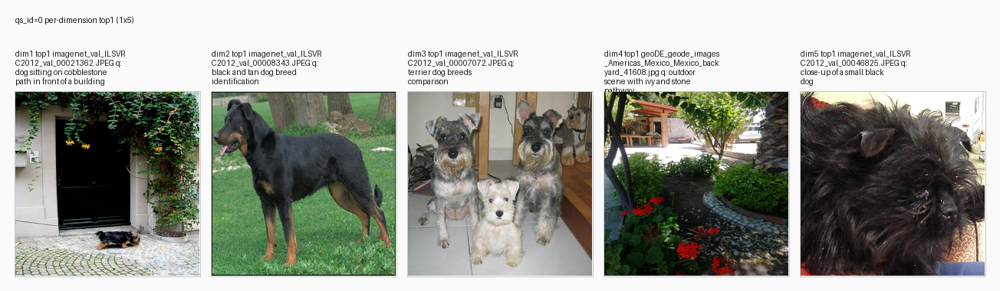

原图 + 最终融合 top5（1x6）：

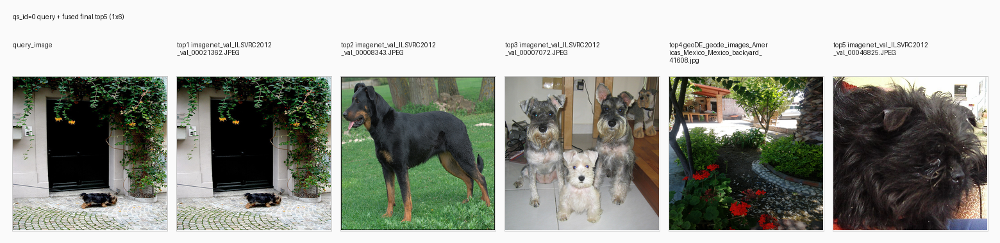

总览网格（5维 x 每维top5，红框表示跨维重复命中）：

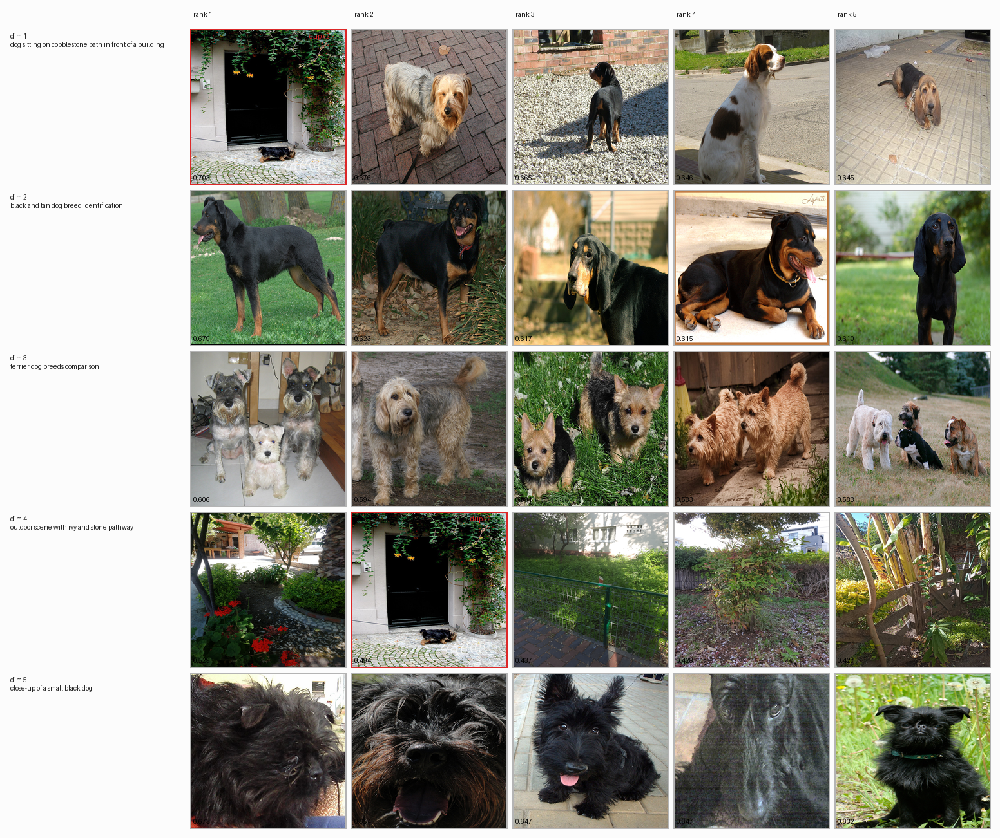

### 2.3 每个维度的检索结果（top5，当前最新版）

- dim1（dog sitting on cobblestone...）: `00021362`, `00002222`, `00034221`, `00015176`, `00028716`
- dim2（black and tan dog breed...）: `00008343`, `00025059`, `00026692`, `00018972`, `00018811`
- dim3（terrier dog breeds comparison）: `00007072`, `00022593`, `00009525`, `00018809`, `00001923`
- dim4（outdoor scene with ivy...）: `geoDE...Mexico_backyard_41608`, `00021362`, `geoDE...Romania_backyard_41787`, `geoDE...Japan_tree_40574`, `geoDE...Argentina_fence_60366`
- dim5（close-up of a small black dog）: `00046825`, `00007801`, `00049757`, `00041568`, `00013524`

重复命中最明显的是：

- `imagenet_val_ILSVRC2012_val_00021362`（dim1 rank1 + dim4 rank2）

### 2.4 融合后最终 top5（RRF）

RRF 公式：`sum(1 / (60 + rank))`

最终 top5：

1. `imagenet_val_ILSVRC2012_val_00021362`（fusion_score=0.0325）
2. `imagenet_val_ILSVRC2012_val_00008343`（fusion_score=0.0164）
3. `imagenet_val_ILSVRC2012_val_00007072`（fusion_score=0.0164）
4. `geoDE_geode_images_Americas_Mexico_Mexico_backyard_41608`（fusion_score=0.0164）
5. `imagenet_val_ILSVRC2012_val_00046825`（fusion_score=0.0164）

### 2.5 LLaVA 最终提示词输入（完整）

`prompt_question_part`：

```text
Additional visual evidence descriptions generated by Gemma4. Use them as auxiliary evidence together with the images; answer with only the option letter.
query_image (0.png): A small, black and tan dog is lying down on a paved area in front of a building. The dog has a shaggy coat.
retrieved_rank_1 (imagenet_val_ILSVRC2012_val_00021362.JPEG): A small, black and tan dog is lying down on a paved area in front of a building. The dog has a shaggy coat.
retrieved_rank_2 (imagenet_val_ILSVRC2012_val_00008343.JPEG): The image shows a medium-to-large black dog with tan/brown markings on its legs and face. The dog has short fur and an alert expression with its mouth slightly open, showing its tongue. It is standing on green grass outdoors.
retrieved_rank_3 (imagenet_val_ILSVRC2012_val_00007072.JPEG): The image contains three dogs of varying sizes and coat colors, appearing to be terriers. One dog on the left has a grizzled gray and brown coat. The dog on the right has a darker, shaggier gray coat. The dog in the center is smaller with a light cream or white coat. All three dogs have wiry or medium-length coats and facial features consistent with terrier breeds.
retrieved_rank_4 (geoDE_geode_images_Americas_Mexico_Mexico_backyard_41608.jpg): The image displays a garden or outdoor area with lush green foliage, some trees, and a stone wall. There are also plants with red and green leaves in the foreground. There are no animals visible in the image.
retrieved_rank_5 (imagenet_val_ILSVRC2012_val_00046825.JPEG): The image shows a close-up of a dog with long, thick, black, shaggy fur. The dog has dark eyes and a somewhat wrinkled or expressive face.

Can you identify this animal?
 Choices:
A: silky_terrier
B: Yorkshire_terrier
C: Australian_terrier
D: Cairn_terrier
```

---

## 3) 可视化脚本（已更新）

脚本：`scripts/visualize_e8.py`

支持输出：

- `qs_x_dim_top1_1x5.png`
- `qs_x_query_plus_final_top5_1x6.png`
- `qs_x_dim_topk_grid.png`（维度 x rank 的总览网格）
- `qs_x_visualization_report.json`

服务器执行（推荐）：

```bash
cd /public/home/hzh/mRAG
python scripts/visualize_e8.py --all --strict-missing
```

---

## 4) 让“5条维度query的理由/推理过程”进入日志

你需要用新参数重跑 pipeline：

```bash
python test/pipeline_multi_dim_rag.py \
  --dim-generator-type gemma4_local \
  --gemma4-dim-rationale \
  ...  # 其余参数保持你当前实验设置
```

重跑后新增字段：

- `trace.jsonl`:
  - `dimension_generation.queries[].rationale`
  - `dimension_generation.raw_generation_text`
  - `dimension_generation.prompt_input.with_rationale`
- `dims.jsonl`:
  - `rationales`
  - `raw_generation_text`
- `smoke.jsonl`:
  - `meta_dim_rationales`

---

## 5) E8 当前结论（旧日志）

- 仅 `qs_id=0` 成功生成 5 个维度；`qs_id=1..4` 退化为 1 维（受 CUDA 报错影响）。
- 当前日志能看 query，但不能看“query理由”；该问题已通过代码改动支持，需重跑生效。

---

## 6) 以后固定操作手册（按这个执行）

下面是**可直接照做**的标准流程，不需要再看聊天记录。

### 6.1 在服务器上重跑（生成带 rationale 的新日志）

```bash
cd /public/home/hzh/mRAG

mkdir -p log/E8
export CORPUS_DIR=data/image_corpus

python test/pipeline_multi_dim_rag.py \
  --dataset-name uclanlp/MRAG-Bench \
  --corpus-dir "${CORPUS_DIR}" \
  --dim-generator-type gemma4_local \
  --gemma4-local-dir models/gemma4-e2b \
  --gemma4-model-id google/gemma-4-E2B-it \
  --gemma4-device cuda:0 \
  --gemma4-dim-rationale \
  --n-dims 5 \
  --dim-top-k 5 \
  --final-top-k 5 \
  --fusion-strategy rrf \
  --final-answerer llava \
  --describe-final-images \
  --magiclens-platform cpu \
  --max-samples 5 \
  --llava-device-map balanced \
  --llava-max-images 1 \
  --llava-max-new-tokens 64 \
  --answers-file log/E8/gemma4_multi_dim_smoke.jsonl \
  --summary-out log/E8/gemma4_multi_dim_smoke_summary.json \
  --save-dimensions-jsonl log/E8/gemma4_multi_dim_smoke_dims.jsonl \
  --trace-jsonl log/E8/gemma4_multi_dim_smoke_trace.jsonl > E8.log 2>&1
```

> 如果你有自己稳定的一套参数（模型路径、device、batch 等），保留你的参数，只要确保包含 `--gemma4-dim-rationale`。

### 6.2 生成所有可视化图

```bash
cd /public/home/hzh/mRAG
python scripts/visualize_e8.py --all --strict-missing --trace-jsonl log/E8/gemma4_multi_dim_smoke_trace.jsonl --out-dir log/E8/figures
```

这一步会为每个 `qs_id` 生成：

- `qs_<id>_dim_top1_1x5.png`
- `qs_<id>_query_plus_final_top5_1x6.png`
- `qs_<id>_dim_topk_grid.png`
- `all_visualization_report.json`

### 6.3 快速自检（必须过）

1) 检查维度理由字段是否存在：

```bash
python - <<'PY'
import json
from pathlib import Path
p = Path("log/E8/gemma4_multi_dim_smoke_trace.jsonl")
ok = 0
for ln in p.read_text(encoding="utf-8").splitlines():
    x = json.loads(ln)
    qs = x.get("dimension_generation", {}).get("queries", [])
    if qs and any(str(i.get("rationale", "")).strip() for i in qs):
        ok += 1
print("samples_with_rationale:", ok)
PY
```

2) 检查可视化是否有 missing（理想是 0）：

```bash
python - <<'PY'
import json
from pathlib import Path
p = Path("log/E8/figures/all_visualization_report.json")
r = json.loads(p.read_text(encoding="utf-8"))
if isinstance(r, dict): r = [r]
total = sum(len(i.get("missing_image_paths", [])) for i in r)
print("missing_images_total:", total)
PY
```

3) 检查 LLaVA 提示词是否写入 trace：

```bash
python - <<'PY'
import json
from pathlib import Path
p = Path("log/E8/gemma4_multi_dim_smoke_trace.jsonl")
for ln in p.read_text(encoding="utf-8").splitlines():
    x = json.loads(ln)
    qid = x["sample"]["qs_id"]
    t = x["llava_answer"].get("prompt_question_part", "")
    print(qid, "prompt_len=", len(t))
PY
```

### 6.4 文档更新清单（每次实验后）

每次重跑后，按下面顺序更新本文件：

1. 更新“第 2 节”中的示例（建议继续用 `qs_id=0`）。
2. 把最新三张图路径确认无误（`1x5`、`1x6`、`dim_topk_grid`）。
3. 在“第 2.1 节”补上 `rationale`（如果该次有）。
4. 在“第 2.5 节”替换为最新 `prompt_question_part`。
5. 在“第 5 节”更新结论（比如是否仍有 CUDA 退化）。

---

## 7) 常见问题与处理

- `MISSING` 图片很多  
  - 原因：在本地跑了服务器日志。  
  - 处理：只在服务器仓库根目录执行，且加 `--strict-missing`。

- 没有 `rationale` 字段  
  - 原因：运行时没开 `--gemma4-dim-rationale`，或维度生成失败并 fallback。  
  - 处理：带该参数重跑，并检查 CUDA 错误。

- 只有 1 维 query，不是 5 维  
  - 原因：维度生成失败后 fallback。  
  - 处理：查看 `dimension_generation.error`、`raw_generation_text`，优先排查 Gemma4/CUDA。

---

## 8) E8 完整实验报告（最新版）

本节基于当前 `log/E8` 下最新文件：

- `gemma4_multi_dim_smoke_summary.json`
- `gemma4_multi_dim_smoke_dims.jsonl`
- `gemma4_multi_dim_smoke.jsonl`
- `gemma4_multi_dim_smoke_trace.jsonl`
- `figures/*.png`

### 8.1 实验目的

E8 的目标是验证：在 MRAG-Bench 上，是否能通过 **Gemma4 多模态维度规划（5 维） + MagicLens 分维检索 + RRF 融合 + LLaVA 决策**，提升多图证据问答的可解释性与准确率。

具体关注点：

1. 能否稳定生成 5 条维度 query（且给出 `rationale`）；
2. 多维检索是否带来候选互补（而非完全重复）；
3. 融合后 top5 是否更接近 GT；
4. LLaVA 在增强提示词输入下是否能输出有效选项（A/B/C/D）。

### 8.2 实验设置

- 数据集：`uclanlp/MRAG-Bench`
- 样本数：`max_samples=5`（smoke）
- 维度生成：`gemma4_local`，模型 `google/gemma-4-E2B-it`
- 维度参数：`n_dims=5`
- 检索：MagicLens，`dim_top_k=5`
- 融合：`rrf`，`final_top_k=5`
- 最终回答：`llava`
- LLaVA 输入图数：`llava_max_images=1`
- 运行平台：Gemma4 在 `cuda:0`；MagicLens `cpu`

### 8.3 主要结果（定量）

来自 `gemma4_multi_dim_smoke_summary.json`：

- `processed=5`
- `correct=0`
- `accuracy=0.0`
- `dim_gen_failures=4`
- `avg_dim_gen_time_sec=3.366`
- `avg_retrieval_time_sec=1.852`

分场景准确率：

- `Scope=0.0`
- `Obstruction=0.0`
- `Temporal=0.0`
- `Deformation=0.0`

### 8.4 过程观察（关键现象）

1) **仅 `qs_id=0` 完成了真正 5 维生成**  
`dims.jsonl` 显示 `qs_id=0` 有 5 条 query + 5 条 rationale + 完整 `raw_generation_text`（JSON）。

2) **其余 4 条样本退化为 fallback 单维**  
`qs_id=1..4` 只保留 1 条 query，`rationale` 为：
`fallback: dimension generation failed, using fallback instruction`。  
`trace` 中对应 `dimension_generation.error` 均为 CUDA device-side assert。

3) **LLaVA 阶段未产出有效选项**  
`smoke.jsonl` 中 5 条均 `meta_pred_choice="N/A"`，`output=""`，并伴随 `meta_llava_error`（CUDA device-side assert）。

### 8.5 `qs_id=0` 代表性样例解读

`qs_id=0` 是本轮唯一“多维规划成功”的样本，可用于展示完整链路。

- 5 条 query（含 rationale）已写入：
  - `dimension_generation.queries[].query`
  - `dimension_generation.queries[].rationale`
- 分维检索：5 维 x top5，共 25 候选，去重后 24。
- 融合后 top1：`imagenet_val_ILSVRC2012_val_00021362.JPEG`
  - 来自 dim1 rank1 + dim4 rank2，RRF 累积分数最高。
- 图像证据描述：`gemma4_image_descriptions.items` 完整（本条无空描述）。

对应图示：

- `figures/qs_0_dim_top1_1x5.png`
- `figures/qs_0_dim_topk_grid.png`
- `figures/qs_0_query_plus_final_top5_1x6.png`

### 8.6 结果结论

本轮 E8 的结论是：

1. **可解释链路已打通**：日志具备 query、rationale、分维结果、融合贡献、LLaVA 提示词等完整字段；
2. **稳定性仍是主要瓶颈**：5 条里 4 条在维度生成阶段 CUDA 报错并 fallback；
3. **端到端准确率当前不可用**：LLaVA 输出为空，导致 `N/A` 与 0% accuracy；
4. **建议后续优先做稳定性修复**：先让 5/5 样本都完成多维生成与非空 LLaVA 输出，再评估检索策略本身。

### 8.7 下一步执行建议（直接照做）

1. 调试时加：
   - `CUDA_LAUNCH_BLOCKING=1`
2. 保留当前命令但先跑 `max_samples=1`，确认：
   - `dimension_generation.error=null`
   - `meta_pred_choice` 非 `N/A`
3. 再扩到 `max_samples=5`，检查：
   - `dim_gen_failures==0`
   - `all_visualization_report.json` 中 `missing_image_paths` 全为空

### 8.8 本次 pull 同步摘要（你刚执行的结果）

来自终端 `make pull result y`（APPLY）：

- 新增/更新了 E8 的 4 份核心结果文件：`smoke.jsonl`、`dims.jsonl`、`summary.json`、`trace.jsonl`
- 同步了 `figures/` 全套可视化（`qs_0..qs_4` 的 1x5、grid、1x6）
- 本次变更规模：约 `21` 个文件，约 `9.14MB`

可视化完整性（以 `figures/all_visualization_report.json` 为准）：

- `qs_id=0..4` 均有 `dim_top1` / `dim_topk_grid` / `query_plus_final_top5`
- `missing_image_paths` 全为空（图片引用完整）

> 注：如果你重新 pull 过图和日志，建议每次都重跑一次可视化脚本，确保 `figures/all_visualization_report.json` 与当前 trace 同步：
>
> `python scripts/visualize_e8.py --all --strict-missing --trace-jsonl log/E8/gemma4_multi_dim_smoke_trace.jsonl --out-dir log/E8/figures`

---

## 9) E8 图片总览（按 qs_id）

本节直接展示本次 E8 生成的关键图。每个 `qs_id` 都包括三类图：

- `dim_top1_1x5`：5 个维度各自 top1
- `dim_topk_grid`：维度 x rank 的总览（看重复与排序）
- `query_plus_final_top5_1x6`：原图 + 融合后 top5

### qs_id=0


### qs_id=1

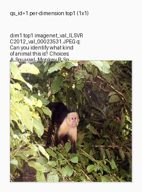

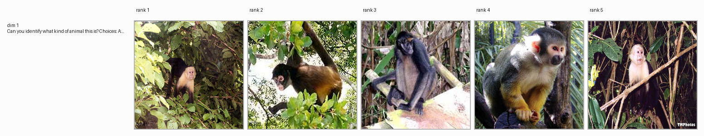

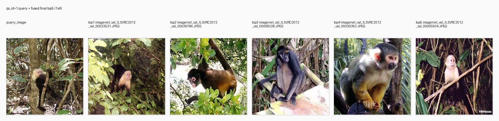

### qs_id=2

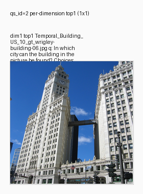

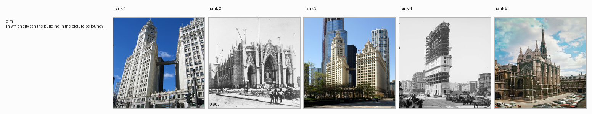

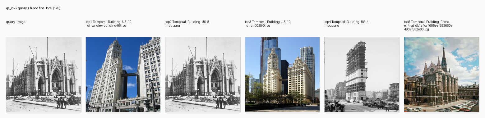

### qs_id=3

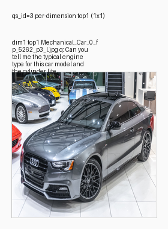

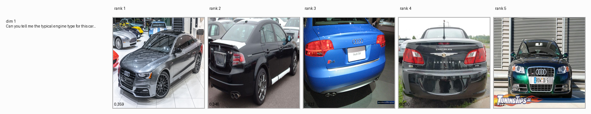

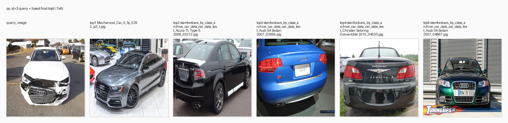

### qs_id=4

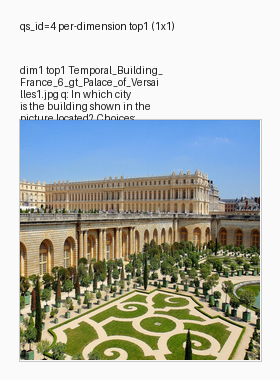

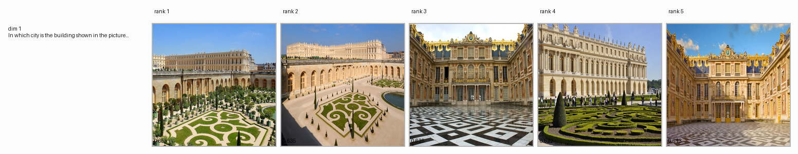

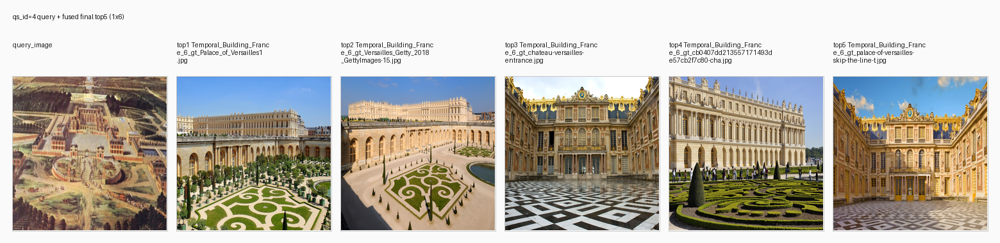

---

## 10) Gemma4 如何推理出 5 个维度（messages + 结果）

### 10.1 先澄清 `rationale` 是什么

- `rationale` 不是“隐藏思维链”。
- 在当前实现里，它是模型显式输出的一句**简短理由**，用于解释“为什么这个维度 query 有助于答题”。
- 真正用于可审计复盘的是：`messages` 输入 + `raw_generation_text` 输出 JSON。

### 10.2 当前代码给 Gemma4 的 messages（本实验模式）

你这次是 `--gemma4-dim-rationale` 模式，对应 `generate_retrieval_plan_with_rationales_gemma4()`。  
它给 Gemma4 的输入是一个 user message（含图 + 文本）：

```text
role=user
content:
  - type=image, image=<query_image_absolute_path>
  - type=text, text=
    You are a retrieval planner for visual QA.
    Given the image and question, produce exactly 5 complementary retrieval dimensions.
    For each dimension, include:
    - "query": one concise image-search instruction in English (<=30 words)
    - "rationale": one short reason (<=25 words) explaining why this dimension helps answer the question
    Return ONLY valid JSON. No markdown fences. No extra text.
    JSON schema example: {"dimensions":[{"query":"...","rationale":"..."}]}
    Question with choices:
    <question_with_choices>
```

### 10.3 `qs_id=0` 的 5 维结果（真实输出）

来自 `gemma4_multi_dim_smoke_dims.jsonl`：

1. query: `dog sitting on cobblestone path in front of a building`  
   rationale: `This focuses on identifying the main subject, the dog, in its environment.`
2. query: `black and tan dog breed identification`  
   rationale: `This aims to get breed-specific information about the dog's appearance.`
3. query: `terrier dog breeds comparison`  
   rationale: `This helps narrow down the options by focusing on the category of dogs presented.`
4. query: `outdoor scene with ivy and stone pathway`  
   rationale: `This captures the background context, which might offer clues about the location or style.`
5. query: `close-up of a small black dog`  
   rationale: `A close-up might reveal finer details of the dog's coat and features.`

`raw_generation_text` 也已在日志中完整保留（JSON 字符串）。

---

## 11) LLaVA messages、回答、正确性、5题得分

### 11.1 LLaVA 的 messages 结构（本实验）

每题都会记录在 `trace.jsonl -> llava_answer`：

- `image_sequence`：送入 LLaVA 的图像顺序（slot0=query，slot1..5=retrieved）
- `prompt_question_part`：最终文本提示词（含 Gemma4 图像描述 + 题目与选项）
- `raw_output`：LLaVA 原始输出
- `pred_choice`：抽取到的选项
- `gt_choice`：标准答案选项
- `is_correct`：是否正确

### 11.2 本次 5 道题逐题结果

来自 `gemma4_multi_dim_smoke.jsonl`：

- `qs_id=0`: pred=`N/A`, gt=`A`, correct=`false`, output为空
- `qs_id=1`: pred=`N/A`, gt=`C`, correct=`false`, output为空
- `qs_id=2`: pred=`N/A`, gt=`C`, correct=`false`, output为空
- `qs_id=3`: pred=`N/A`, gt=`A`, correct=`false`, output为空
- `qs_id=4`: pred=`N/A`, gt=`D`, correct=`false`, output为空

### 11.3 5题总分

- 总题数：5
- 正确数：0
- 准确率：0.0

说明：每题 `meta_llava_error` 都是 CUDA device-side assert，这与 `N/A` 和空输出一致。

---

## 12) 直接修复 `pred=N/A`（可复制命令）

`pred=N/A` 的直接原因是 LLaVA 阶段抛异常后被兜底为 `N/A`。  
下面用“最小稳定配置”先拿到可用预测：

```bash
cd /public/home/hzh/mRAG
mkdir -p log/E8_fix
export CORPUS_DIR=data/image_corpus
export CUDA_LAUNCH_BLOCKING=1

python test/pipeline_multi_dim_rag.py \
  --dataset-name uclanlp/MRAG-Bench \
  --corpus-dir "${CORPUS_DIR}" \
  --dim-generator-type gemma4_local \
  --gemma4-local-dir models/gemma4-e2b \
  --gemma4-model-id google/gemma-4-E2B-it \
  --gemma4-device cuda:0 \
  --gemma4-dim-rationale \
  --n-dims 5 \
  --dim-top-k 5 \
  --final-top-k 5 \
  --fusion-strategy rrf \
  --final-answerer llava \
  --describe-final-images \
  --magiclens-platform cpu \
  --max-samples 1 \
  --llava-device-map cuda:0 \
  --llava-max-images 1 \
  --llava-max-new-tokens 64 \
  --answers-file log/E8_fix/e8_fix.jsonl \
  --summary-out log/E8_fix/e8_fix_summary.json \
  --save-dimensions-jsonl log/E8_fix/e8_fix_dims.jsonl \
  --trace-jsonl log/E8_fix/e8_fix_trace.jsonl > log/E8_fix/E8_fix.log 2>&1
```

### 12.1 成功判据

- `log/E8_fix/e8_fix.jsonl` 中 `meta_pred_choice` 是 `A/B/C/D`（不是 `N/A`）
- `meta_llava_error` 为空
- `output` 非空

### 12.2 如果仍是 `N/A`

按顺序试：

1. 把 `--describe-final-images` 去掉（先验证 LLaVA 主链路）
2. 把 `--llava-max-new-tokens` 降到 `16`
3. 继续固定 `--llava-max-images 1`
4. 确保 Gemma 在 `cuda:0`、LLaVA 在 `cuda:1`（不要同卡）

备注：`rationale` 仅用于解释和审计，不直接拼接到检索 query。不要开启 `--dim-retrieval-use-rationale`。

补充：当前 `pipeline_multi_dim_rag.py` 已实现 CUDA 统一策略。若 `final_answerer=llava` 且 `gemma4_device` 是 `cuda:X`，则会自动把 LLaVA 也固定到同一 `cuda:X`（覆盖 `--llava-device-map`）。

---

## 13) E8_fix 诊断结论（单样本最小复现）

基于你拉取的 `log/E8_fix`：

- `e8_fix_summary.json`
- `e8_fix.jsonl`
- `e8_fix_dims.jsonl`
- `e8_fix_trace.jsonl`

### 13.1 结果快照

- `processed=1`
- `dim_gen_failures=0`（Gemma4 五维生成成功）
- `meta_pred_choice=N/A`
- `output=""`
- `meta_llava_error=CUDA error: device-side assert triggered`

### 13.2 关键判断

这次最小复现证明：

1. **Gemma4 维度规划不是问题点**  
   `dims` 与 `trace` 中 5 条 query + rationale 都完整生成。

2. **MagicLens 检索与融合不是问题点**  
   `meta_per_dim_retrieval`、`meta_fused_retrieval` 都正常写出。

3. **问题收敛到 LLaVA 推理阶段本身**  
   即使只跑 1 条样本，`pred` 仍退化为 `N/A`，且报同样 CUDA assert。

### 13.3 当前最可能根因

- LLaVA 权重与当前代码/依赖组合兼容性问题（视觉塔或多模态输入路径）
- 运行环境中的 CUDA 内核断言（版本组合或运行时状态）

### 13.4 下一步（建议顺序）

1. 保持 pipeline 不变，先用 **独立最小 LLaVA smoke** 脚本测试单图生成；
2. 若最小 smoke 也报错，优先处理 LLaVA 模型/环境兼容；
3. 若最小 smoke 正常，再回到 pipeline 排查输入拼装差异。

### 13.5 已按 E0-E7 兼容思路做的代码修复

已在 `src/mrag/llava.py` 做两项兼容修复（用于对齐 E0-E7 稳定路径）：

1. **尊重 `--llava-device-map` 目标卡**  
   之前会无条件把模型 `.to(cuda:0)`；现在会按 device_map 的 `{"": "cuda:X"}` 选择目标设备。

2. **LLaVA `<image>` token 兼容回退**  
   先用当前空格分隔模式（`<image> <image> ...`）推理；若出现 CUDA device-side assert，则自动回退到 E0-E7 常见拼接模式（`<image><image>...`）再试一次。

---

## 14) 本次 `E8_fix` 之后的复测命令（可直接复制）

你这次 `E8_fix` 结果已经说明：检索链路正常，`N/A` 卡在 LLaVA 推理。  
建议按下面 3 步跑，避免一次性混在一起难定位。

### 14.1 最小 LLaVA 单测（不走 RAG）

目的：先确认 LLaVA 模型本体是否能在当前环境完成最基本单图推理。  
若这一步都报 `device-side assert`，优先处理模型与环境兼容，不要继续调 pipeline 参数。

```bash
cd /public/home/hzh/mRAG
export CUDA_VISIBLE_DEVICES=0
export CUDA_LAUNCH_BLOCKING=1
python - <<'PY'
from PIL import Image
import torch
from test.pipeline_multi_dim_rag import _load_llava_helpers

class Args:
    llava_model_path = "models/llava-onevision-qwen2-7b-ov"
    llava_device_map = "cuda:0"
    llava_attn_implementation = "sdpa"
    llava_load_4bit = False
    llava_load_8bit = False
    llava_allow_cpu_offload = False
    llava_num_beams = 1
    llava_max_new_tokens = 16

load_llava, llava_answer = _load_llava_helpers()
tok, model, img_proc = load_llava(Args())
img = Image.open("results/query_images/mrag_bench/0.png").convert("RGB")
item = {"question": "Answer with only A/B/C/D. What is this animal? A:silky_terrier B:Yorkshire_terrier C:Australian_terrier D:Cairn_terrier"}
out = llava_answer(tok, model, img_proc, item, [img], Args())
print(out)
PY
```

### 14.2 Pipeline 复测 A（先去掉描述增强）

目的：排除 `--describe-final-images` 带来的长文本/拼接差异，先验证主链路可用。

```bash
cd /public/home/hzh/mRAG
mkdir -p log/E8_fixA
export CORPUS_DIR=data/image_corpus
export CUDA_LAUNCH_BLOCKING=1

python test/pipeline_multi_dim_rag.py \
  --dataset-name uclanlp/MRAG-Bench \
  --corpus-dir "${CORPUS_DIR}" \
  --dim-generator-type gemma4_local \
  --gemma4-local-dir models/gemma4-e2b \
  --gemma4-model-id google/gemma-4-E2B-it \
  --gemma4-device cuda:0 \
  --gemma4-dim-rationale \
  --n-dims 5 \
  --dim-top-k 5 \
  --final-top-k 5 \
  --fusion-strategy rrf \
  --final-answerer llava \
  --magiclens-platform cpu \
  --max-samples 1 \
  --llava-max-images 1 \
  --llava-max-new-tokens 16 \
  --answers-file log/E8_fixA/e8_fixA.jsonl \
  --summary-out log/E8_fixA/e8_fixA_summary.json \
  --save-dimensions-jsonl log/E8_fixA/e8_fixA_dims.jsonl \
  --trace-jsonl log/E8_fixA/e8_fixA_trace.jsonl > log/E8_fixA/E8_fixA.log 2>&1
```

### 14.3 Pipeline 复测 B（再加回描述增强）

目的：A 通过后，再验证描述增强是否会再次触发崩溃。

```bash
cd /public/home/hzh/mRAG
mkdir -p log/E8_fixB
export CORPUS_DIR=data/image_corpus
export CUDA_LAUNCH_BLOCKING=1

python test/pipeline_multi_dim_rag.py \
  --dataset-name uclanlp/MRAG-Bench \
  --corpus-dir "${CORPUS_DIR}" \
  --dim-generator-type gemma4_local \
  --gemma4-local-dir models/gemma4-e2b \
  --gemma4-model-id google/gemma-4-E2B-it \
  --gemma4-device cuda:0 \
  --gemma4-dim-rationale \
  --n-dims 5 \
  --dim-top-k 5 \
  --final-top-k 5 \
  --fusion-strategy rrf \
  --final-answerer llava \
  --describe-final-images \
  --magiclens-platform cpu \
  --max-samples 1 \
  --llava-max-images 1 \
  --llava-max-new-tokens 16 \
  --answers-file log/E8_fixB/e8_fixB.jsonl \
  --summary-out log/E8_fixB/e8_fixB_summary.json \
  --save-dimensions-jsonl log/E8_fixB/e8_fixB_dims.jsonl \
  --trace-jsonl log/E8_fixB/e8_fixB_trace.jsonl > log/E8_fixB/E8_fixB.log 2>&1
```

### 14.4 结果判读

- 若 **14.1 就崩**：LLaVA 模型/代码/依赖兼容性问题为主因（非检索链路）。
- 若 **14.1 正常、14.2 崩**：pipeline 内 LLaVA 输入拼装仍有兼容问题。
- 若 **14.2 正常、14.3 崩**：重点排查 `--describe-final-images` 追加文本路径。

---

## 15) E8_final（5样本）结果详解（已跑通）

本次 `E8_final`（`max-samples=5`）已完成，且不再出现 `pred=N/A`。

### 15.1 总体指标

- `processed=5`
- `correct=3`
- `accuracy=60.0%`
- `dim_gen_failures=0`
- `avg_dim_gen_time_sec=20.112`
- `avg_retrieval_time_sec=3.815`
- `final_answerer=llava`

按场景准确率：

- `Scope`: `0.0%`（0/1）
- `Obstruction`: `100.0%`（1/1）
- `Temporal`: `50.0%`（1/2）
- `Deformation`: `100.0%`（1/1）

### 15.2 稳定性结论（关键）

- 5/5 样本均有有效输出：`meta_pred_choice` 全为 `A/B/C/D`，无 `N/A`
- 5/5 样本 `meta_llava_error = null`
- 说明此前 `SigLip position embedding` 导致的 LLaVA CUDA 崩溃已被修复

### 15.3 逐题结果（qs_id=0..4）

- `qs_id=0`（Scope / Perspective）: pred=`B`, gt=`A`, ❌  
  现象：检索包含多张 terrier 近邻图，最终选择偏向 `Yorkshire_terrier`。
- `qs_id=1`（Obstruction / Perspective）: pred=`C`, gt=`C`, ✅
- `qs_id=2`（Temporal / Transformative）: pred=`B`, gt=`C`, ❌  
  现象：融合结果前列混入多张 `Temporal_Building_France_*`，城市判断受干扰。
- `qs_id=3`（Deformation / Transformative）: pred=`A`, gt=`A`, ✅
- `qs_id=4`（Temporal / Transformative）: pred=`D`, gt=`D`, ✅

### 15.4 图像总览（本次结果对应）

#### qs_id=0


#### qs_id=1


#### qs_id=2


#### qs_id=3


#### qs_id=4


---

## 16) 全量数据集（1353）夜跑脚本（可直接复制）

> 目标：在当前已验证稳定配置下，运行完整 MRAG-Bench；你可以直接后台挂起后睡觉。

### 16.0 为什么会慢（你现在看到 90~100s/样本）

当前速度慢是预期内的，主要由三部分叠加：

1. `--describe-final-images` 会让 Gemma4 额外描述 1(query)+5(retrieved) 共 6 张图；
2. Gemma4 维度生成 + 描述、LLaVA 推理都在同一张 GPU 串行执行；
3. 开了 `CUDA_LAUNCH_BLOCKING=1`（调试模式）会显著拖慢 CUDA 执行。

提速建议（按优先级）：

- 生产跑把 `CUDA_LAUNCH_BLOCKING` 设为 `0`（仅调试时设为 `1`）；
- 保持 `--llava-max-images 1`（当前最稳）；
- 若先追求吞吐，可临时去掉 `--describe-final-images`（速度会明显提升）。

### 16.1 一键脚本方式（推荐）

仓库内已提供：

- `scripts/run_e8_nightly.sh`

该脚本行为：

1. 先跑 `E8_final`（5样本）做 sanity；
2. 自动检查是否存在 `N/A` / 空输出 / `meta_llava_error`；
3. 检查通过后自动 `nohup` 启动全量 `E8_full`。

执行：

```bash
cd /public/home/hzh/mRAG
bash scripts/run_e8_nightly.sh
```

查看后台进度：

```bash
tail -f log/E8_full/E8_full.log
```

### 16.1.1 断点续跑（checkpoint）

`pipeline_multi_dim_rag.py` 已支持：

- `--resume-from-existing`

行为：

- 若 `answers-file` 已存在，则读取其中已有 `qs_id`；
- 运行时自动跳过已完成样本；
- 以追加模式写入 `answers/dims/trace`，避免重复计算。

继续你当前跑到一半的任务可直接用（示例）：

```bash
cd /public/home/hzh/mRAG
mkdir -p log/E8_full
export CORPUS_DIR=data/image_corpus
export CUDA_LAUNCH_BLOCKING=0

nohup python test/pipeline_multi_dim_rag.py \
  --dataset-name uclanlp/MRAG-Bench \
  --corpus-dir "${CORPUS_DIR}" \
  --dim-generator-type gemma4_local \
  --gemma4-local-dir models/gemma4-e2b \
  --gemma4-model-id google/gemma-4-E2B-it \
  --gemma4-device cuda:0 \
  --gemma4-dim-rationale \
  --n-dims 5 \
  --dim-top-k 5 \
  --final-top-k 5 \
  --fusion-strategy rrf \
  --final-answerer llava \
  --describe-final-images \
  --magiclens-platform cpu \
  --resume-from-existing \
  --llava-max-images 1 \
  --llava-max-new-tokens 64 \
  --answers-file log/E8_full/e8_full.jsonl \
  --summary-out log/E8_full/e8_full_summary.json \
  --save-dimensions-jsonl log/E8_full/e8_full_dims.jsonl \
  --trace-jsonl log/E8_full/e8_full_trace.jsonl > log/E8_full/E8_full.log 2>&1 &

echo $! > log/E8_full/E8_full.pid
```

### 16.1.2 断点续跑命令（两种运行方式）

#### A) `nohup` 后台版（适合夜跑）

```bash
cd /public/home/hzh/mRAG
mkdir -p log/E8_full
export CORPUS_DIR=data/image_corpus
export CUDA_LAUNCH_BLOCKING=0

nohup python test/pipeline_multi_dim_rag.py \
  --dataset-name uclanlp/MRAG-Bench \
  --corpus-dir "${CORPUS_DIR}" \
  --dim-generator-type gemma4_local \
  --gemma4-local-dir models/gemma4-e2b \
  --gemma4-model-id google/gemma-4-E2B-it \
  --gemma4-device cuda:0 \
  --gemma4-dim-rationale \
  --n-dims 5 \
  --dim-top-k 5 \
  --final-top-k 5 \
  --fusion-strategy rrf \
  --final-answerer llava \
  --describe-final-images \
  --magiclens-platform cpu \
  --resume-from-existing \
  --llava-max-images 1 \
  --llava-max-new-tokens 64 \
  --answers-file log/E8_full/e8_full.jsonl \
  --summary-out log/E8_full/e8_full_summary.json \
  --save-dimensions-jsonl log/E8_full/e8_full_dims.jsonl \
  --trace-jsonl log/E8_full/e8_full_trace.jsonl > log/E8_full/E8_full.log 2>&1 &

echo $! > log/E8_full/E8_full.pid
cat log/E8_full/E8_full.pid
```

#### B) 前台版（适合实时观察）

```bash
cd /public/home/hzh/mRAG
mkdir -p log/E8_full
export CORPUS_DIR=data/image_corpus
export CUDA_LAUNCH_BLOCKING=0

python test/pipeline_multi_dim_rag.py \
  --dataset-name uclanlp/MRAG-Bench \
  --corpus-dir "${CORPUS_DIR}" \
  --dim-generator-type gemma4_local \
  --gemma4-local-dir models/gemma4-e2b \
  --gemma4-model-id google/gemma-4-E2B-it \
  --gemma4-device cuda:0 \
  --gemma4-dim-rationale \
  --n-dims 5 \
  --dim-top-k 5 \
  --final-top-k 5 \
  --fusion-strategy rrf \
  --final-answerer llava \
  --describe-final-images \
  --magiclens-platform cpu \
  --resume-from-existing \
  --llava-max-images 1 \
  --llava-max-new-tokens 64 \
  --answers-file log/E8_full/e8_full.jsonl \
  --summary-out log/E8_full/e8_full_summary.json \
  --save-dimensions-jsonl log/E8_full/e8_full_dims.jsonl \
  --trace-jsonl log/E8_full/e8_full_trace.jsonl | tee -a log/E8_full/E8_full.log
```

### 16.2 直接全量命令（不走 sanity，手动跑）

```bash
cd /public/home/hzh/mRAG
mkdir -p log/E8_full
export CORPUS_DIR=data/image_corpus
export CUDA_LAUNCH_BLOCKING=0

nohup python test/pipeline_multi_dim_rag.py \
  --dataset-name uclanlp/MRAG-Bench \
  --corpus-dir "${CORPUS_DIR}" \
  --dim-generator-type gemma4_local \
  --gemma4-local-dir models/gemma4-e2b \
  --gemma4-model-id google/gemma-4-E2B-it \
  --gemma4-device cuda:0 \
  --gemma4-dim-rationale \
  --n-dims 5 \
  --dim-top-k 5 \
  --final-top-k 5 \
  --fusion-strategy rrf \
  --final-answerer llava \
  --describe-final-images \
  --magiclens-platform cpu \
  --resume-from-existing \
  --llava-max-images 1 \
  --llava-max-new-tokens 64 \
  --answers-file log/E8_full/e8_full.jsonl \
  --summary-out log/E8_full/e8_full_summary.json \
  --save-dimensions-jsonl log/E8_full/e8_full_dims.jsonl \
  --trace-jsonl log/E8_full/e8_full_trace.jsonl > log/E8_full/E8_full.log 2>&1 &

echo $! > log/E8_full/E8_full.pid
cat log/E8_full/E8_full.pid
```

### 16.3 明早收结果（pull +核查）

在本地执行：

```bash
make pull result y
```

重点检查：

- `log/E8_full/e8_full_summary.json`
- `log/E8_full/e8_full.jsonl`（是否有 `meta_pred_choice=N/A`）
- `log/E8_full/E8_full.log`（是否有 `llava_answer_error`）

